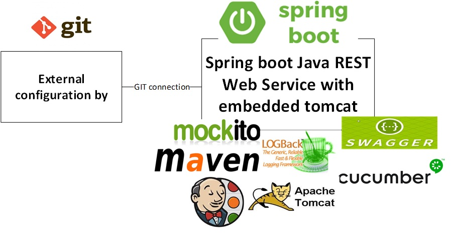

 Spring Boot 2 Inicio Rapido con Maven Archetype
========================================= 

Introducción
-------
Este proyecto es un Maven archetype para Spring Boot web application 
que tiene todos los estándares comunes en el lugar listos para el desarrollo

- Java 1.8+
- Maven 3.5+
- Spring boot 2.1.0.RELEASE+
- Lombok abstraction
- JPA with H2 para explicacion
- Swagger 2 API documentation
- Spring retry and circuit breaker para llamadas de servicios externos
- REST API model validation 
- Spring cloud config para configuraciones externas en GIT REPO
- Cucumber and Spring Boot pruebas de integracion
- Jenkins Pipeline para proyectos con multiples ramas
- integracion y entegra continua estandares con Sonar check y release management
- Support retry in sanity checks 
- Logback configuration  


Installación
------------

para instalar el arquetipo en tu repositorio local ejecuta los siguientes comandos:

```sh
$ git clone https://github.com//spring-boot-quickstart-archtype.git
$ cd spring-boot-quickstart-archtype
$ mvn clean install
```

Create a project
----------------

```sh
$ mvn archetype:generate \
     -DarchetypeGroupId=com.evomatik.spring-boot-archetypes \
     -DarchetypeArtifactId=spring-boot-quickstart \
     -DarchetypeVersion=1.0.0 \
     -DgroupId=com.test \
     -DartifactId=sampleapp \
     -Dversion=1.0.0-SNAPSHOT \
     -DinteractiveMode=false
```

Test on the browser via SWAGGER
-------------------

```sh
http://localhost:8080/swagger-ui.html
```

